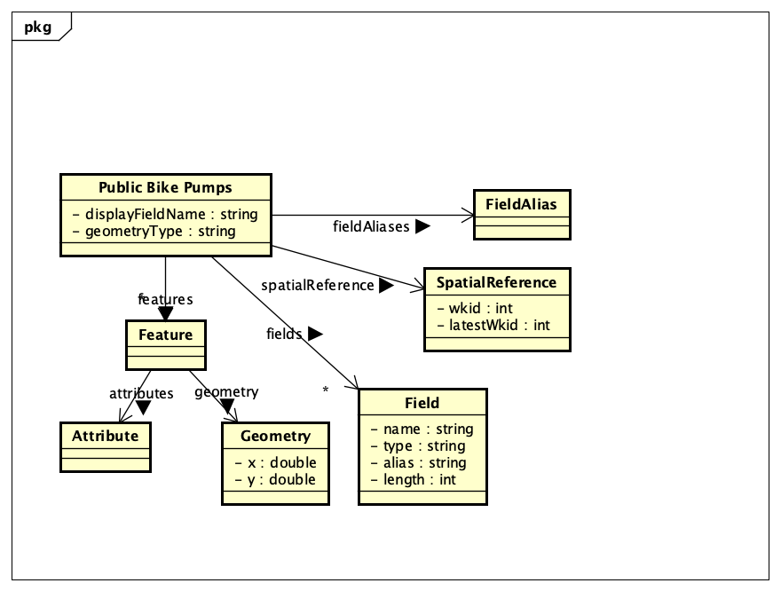

# Implementation 

## Introduction
The name of the Dataset used is Air Quality Dashboard Map (https://opendata.bristol.gov.uk/maps/a26113cd0bef4ef0816242a08ae0b1a6/explore). it contains the annual NO2 in a selected area in bristol and the past NO" concentrations of the area. you can also search using it. of current it was last recorded on the 13th of December 2024. A known issue is the dataset's inability to provide information on all areas apart from if they are marked on the map. 

## Project Structure

[code2.zip](https://github.com/user-attachments/files/19555983/code2.zip)

provide a table listing the number of jslint warnings/reports for each module.

## Software Architecture
Airaware software architecture uses a tree-like architecture where through each branch one can only go back or forward. In this software,e there is only one base page(home.html), and two branch pages(map.html and game.html). (NOTE: you can technically say app.js is a branch of game.html since it borrows its basic functionality from it.)

1. home.html: This serves as the main page(first page) that user interacts with 
    and gives users the option to travel to the other two branch pages.

2. map.html: This serves as a branch page where the user can both view and 
    interact with the AQI map through Bristol Open Data it does not allow the user to view any other type of Database.

3. game.html: This serves as a branch page where the user can interact with the
     system to play a friendly question-and-answer game with the system. Questions are randomized and there are a total of twenty questions.

4. app.js: This is where game.html obtains its functions such as question 
    randomizer, selecting options, congratulation of the user, question selection, etc. This is also where all questions are stored.

## Bristol Open Data API
TODO: Document each query to Bristol Open Data

TODO: Repeat as necessary

# User guide
TODO: Explain how each use-case works by providing step-by-step screenshots for each use-case. This should be based on a tested scenario.

