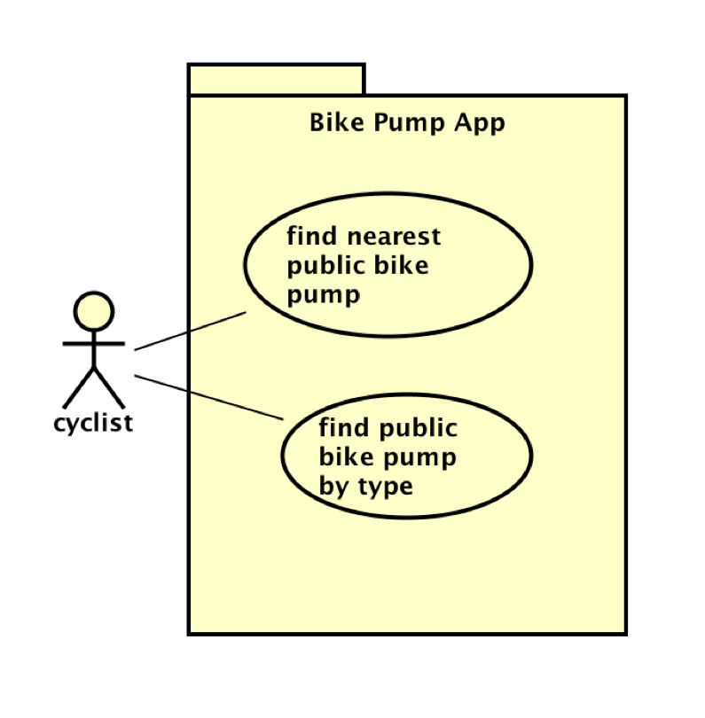

# Requirements

## User Needs

### User stories
User Story 1: Real-Time Air Quality View
As a resident of my neighbourhood;
I would like to have a preview of the current air quality on my street so that I can properly prepare for my outdoor activities.

User Story 2: Search by Location;
As a daily commuter,
I want to search for AQI data by data or postcode to determine which route is healthiest for my regular walks.

User Story 3: Health Advice Based on AQI;
As a health-conscious student,
I want to have fun while studying health so that I would find it entertaining.

User Story 4: Historical Trends and Charts;
As a journalist,
I want to select the historical AQI data of in area so that i can write reports of the changes over time.

### Actors

Cyclist – Uses the app to discover which route will be best for safer commuting. 

Pedestrian – Uses app to discover which paths will user be able to take to avoid polluted areas while walking to their destination.

Daily Commuter – Uses app to decide which mode of transportation will be best for the day to have a healthier commute. 

Parent – Uses AQI map to search places where their children have outdoor activities with low-risk pollution from the air.

Children  – Uses AQI game to learn many air quality facts while having an engaging time.

Environmental Researcher – User AQI MAP to get the Historical Data of a given area in other to aid their research.

### Use Cases

TODO: Your Use-Case diagram should include all use-cases.

## Software Requirements Specification
### Functional requirements
 
The system lets the user search the AQI of an area in the provided search box (UC1) 

The system shall Display available searchable areas on the map with the name of the location(UC1) 

The system shall get regular air quality updates on the map (UC1) 

The system displays whether the user has chosen the correct or incorrect location in the game  (UC2) 

The system allows the user to reset the game with the reset button (UC2) 

### Non-Functional Requirements
The system shall be accessible 24/7 (UC2/UC1) 

The system shall have a clean and mobile-responsive interface. (UC2/UC1) 

The application shall be responsive on different devices such as laptops, phones etc. (UC1/UC2) 

The system shall display data in an easy-to-understand visual format. (UC1) 

The system shall fast pace and engaging (UC2) 

 
